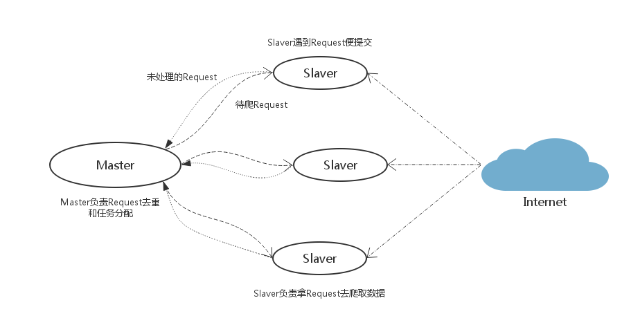

## Scrapy-Redis分布式策略

***任意一台电脑都可以作为Master端或者Slaver端***

* Master（核心服务器）：主体是Redis数据库，不负责数据抓取，只负责URL指纹判重、request分配和数据的存储
* Slaver（爬虫程序执行器）：负责执行爬虫程序，运行过程中提交新的request给Master

1. Slaver端从Master端拿任务(request)进行数据抓取，抓取的数据包含URL则生成新request交给Master处理
2. Master端只有一个Redis数据库，负责将未处理的request去重以及任务分配，将处理后的request入队列，并且存储抓取的数据

