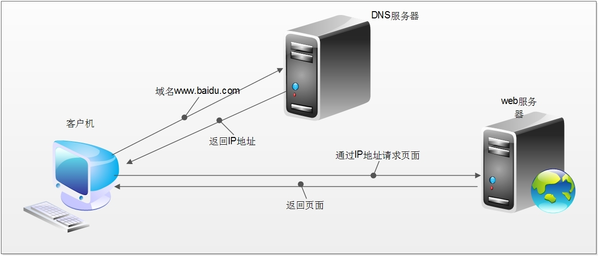
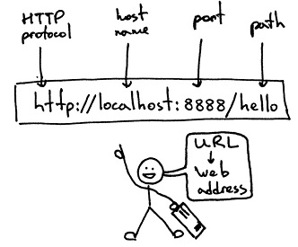

HTTP/HTTPS的请求与响应

### 浏览器地址栏输入[百度](http://www.baidu.com),回车后发生的事情

1. 浏览器通过DNS服务器查找域名对应的IP地址

2. 向IP地址对应的WEB服务器发送请求

3. 服务器响应请求，发回HTML页面

4. 浏览器解析HTML内容并显示

   

---

### DNS

* **DNS**是**计算机域名系统**(_Domain Name System_ 或_Domain Name Service_)的缩写，由解析器和域名服务器组成

* 域名服务器是指保存有该网络中所有主机的域名和对应IP地址，并具有将域名转换为IP地址功能的服务器

* 一般一个域名的 DNS解析时间 在10~60毫秒之间

  > 一个域名必须对应一个IP地址，而一个IP地址不一定会有域名

---

### HTTP和HTTPS（一套计算机通过网络进行通信的规则）

* **HTTP协议**(_HyperText Transfer Protocol_，**超文本传输协议**)，一种发布和接收 HTML页面的方法。端口号：___80___
* **HTTPS**协议(_Hypertext Transfer Protocol over Secure Socket Layer_)，简单讲是HTTP的安全版，在HTTP下加入SSL层。端口号： ___443___
* **SSL**(_Secure Sockets Layer_，**安全套接层**)，主要用于Web的安全传输协议，在传输层对网络连接进行加密，保障在Internet上数据传输的安全

---

### HTTP的请求与响应

> HTTP通信由两部分组成：**客户端请求信息**与**服务器响应信息**


---

### 浏览器发送HTTP请求的过程

1. 当用户在浏览器的地址栏中输入一个URL地址并按回车键之后，浏览器会向HTTP服务器发送HTTP请求

   > HTTP请求___主要___分为**Get**和**Post**两种方法

2. 当在浏览器输入[URL](http://www.google.com)并回车后，浏览器发送一个Request请求去获取该URL的HTML文件，服务器收到并成功解析请求后把Response文件对象发送回给浏览器

3. 浏览器分析Response中的HTML，发现其中引用了很多其他文件，比如Images文件，CSS文件，JS文件。 浏览器会自动再次发送Request去获取图片，CSS文件，或者JS文件等

4. 当所有的文件都下载成功后，网页会根据HTML语法结构，完整的将网页显示出来

   > **URL**(_Uniform / Universal Resource Locator_)：统一资源定位符，是用于完整的描述Internet上网页和其他资源的地址的一种标识方法

   

   基本格式：`scheme://host[:port]/path/…/[?query-string][#anchor]`

   * scheme：协议（例如：http、https、ftp）
   * host：服务器的IP地址或者域名
   * port：服务器的端口（如果走默认协议端口，缺省为___80___端口）
   * path：访问的资源的路径
   * query-string：参数，发送给http服务器的数据
   * anchor：锚（跳转到网页的指定锚点位置）

   > 例如：
   >
   > * <ftp://192.168.0.116:8080/index>
   > * <http://www.baidu.com>
   > * <http://item.jd.com/11936238.html#product-detail>

---

### 客户端HTTP请求

URL只是标识资源的位置，而HTTP是用来提交和获取资源的。客户端发送给服务器的HTTP请求报文包括：`请求行`、`请求头部`、`空行`、`请求数据` 四个部分组成，下图是请求报文的一般格式：


#### 一个典型的HTTP请求示例：

```html
GET https://www.baidu.com/ HTTP/1.1
Host: www.baidu.com
Connection: keep-alive
Upgrade-Insecure-Requests: 1
User-Agent: Mozilla/5.0 (Windows NT 10.0; Win64; x64) AppleWebKit/537.36 (KHTML, like Gecko) Chrome/54.0.2840.99 Safari/537.36
Accept: text/html,application/xhtml+xml,application/xml;q=0.9,image/webp,*/*;q=0.8
Referer: http://www.baidu.com/
Accept-Encoding: gzip, deflate, sdch, br
Accept-Language: zh-CN,zh;q=0.8,en;q=0.6
Cookie: BAIDUID=04E4001F34EA74AD4601512DD3C41A7B:FG=1; BIDUPSID=04E4001F34EA74AD4601512DD3C41A7B; PSTM=1470329258; MCITY=-343%3A340%3A; H_PS_PSSID=1447_18240_21105_21386_21454_21409_21554; BD_UPN=12314753; sug=3; sugstore=0; ORIGIN=0; bdime=0; H_PS_645EC=7e2ad3QHl181NSPbFbd7PRUCE1LlufzxrcFmwYin0E6b%2BW8bbTMKHZbDP0g; BDSVRTM=0
```

#### 请求方法

`GET https://www.baidu.com/ HTTP/1.1`

|   HTTP 0.9    |              只有基本的文本 GET 功能              |
| :-----------: | :--------------------------------------: |
|   HTTP 1.0    | 完善的请求/响应模型，并将协议补充完整，定义了三种请求方法： GET, POST 和 HEAD方法 |
|   HTTP 1.1    | 在 1.0 基础上进行更新，新增了五种请求方法：OPTIONS, PUT, DELETE, TRACE 和 CONNECT 方法 |
| HTTP 2.0（未普及） | 请求/响应首部的定义基本没有改变，只是所有首部键必须全部小写，而且请求行要独立为 :method、:scheme、:host、:path这些键值对 |

根据HTTP标准，HTTP请求可以使用多种请求方法：

|  序号  |    方法    |                    描述                    |                    备注                    |
| :--: | :------: | :--------------------------------------: | :--------------------------------------: |
|  1   | GET（主要）  |             指定请求的页面信息以从服务器获取             | **参数都显示在URL上**（参数是URL的一部分），服务器根据该请求所包含URL中的参数来产生响应内容 |
|  2   | POST（主要） | 向指定资源提交数据进行处理请求（例如提交表单或上传文件），数据被包含在请求体中。POST请求可能导致新资源的建立___和/或___已有资源的修改 | **参数在请求体当中**，消息长度没有限制而且以隐式的方式进行发送 通常用来向HTTP服务器提交量比较大的数据（比如请求中包含许多参数或者文件上传操作等） |
|  3   |   PUT    |          从客户端向服务器传送数据取代指定的文档的内容          |                                          |
|  4   |  DELETE  |               请求服务器删除指定的页面               |                                          |
|  5   |   HEAD   |      类似GET请求，只是返回的响应中没有具体内容，用于获取报头       |                                          |
|  6   | CONNECT  |      HTTP/1.1协议中预留的能将连接改为管道方式的代理服务器      |                                          |
|  7   | OPTIONS  |              允许客户端查看服务器的性能               |                                          |
|  8   |  TRACE   |           回显服务器收到的请求，主要用于测试或诊断           |                                          |

> 页面的form表单一般都有method属性，默认值是"get"
>
> 举个栗子，登录时提交用户名和密码：
>
> * 如果用"get"方式，提交表单后，则用户输入的用户名和密码将在地址栏中暴露无遗
> * 如果设置为"post，则提交表单后，地址栏不会有用户名和密码的显示
>
> 所以处理登录页面的form表单时，发送的请求都是"POST"方式

---

### 常用的请求报头

1. Host（主机和端口号）

   **Host**：对应网址URL中的Web服务器名称和端口号，用于指定被请求资源的Internet主机和端口号，通常属于URL的Host部分

2. Connection（客户端与服务器的连接类型）

   通常情况下：

   > 1. Client发起一个包含`Connection:keep-alive`的请求（HTTP/1.1使用 keep-alive 为默认值）
   > 2. Server收到请求后：
   >    * 如果Server支持keep-alive，回复一个包含`Connection:keep-alive`的响应，不关闭连接
   >    * 如果Server不支持keep-alive，回复一个包含`Connection:close`的响应，关闭连接
   > 3. 如果Client收到包含`Connection:keep-alive`的响应，向同一个连接发送下一个请求，直到一方主动关闭连接
   >
   > > **Connection : keep-alive 在很多情况下能够重用连接，减少资源消耗，缩短响应时间。比如当浏览器需要多个文件时(比如一个HTML文件和多个Image文件)，不需要每次都去请求建立连接**

3. Upgrade-Insecure-Requests（升级为HTTPS请求）

   **Upgrade-Insecure-Requests**：升级不安全的请求，意思是会在加载http资源时自动替换成https请求，让浏览器不再显示https页面中的http请求警报

   > **HTTPS是以安全为目标的HTTP通道，所以在HTTPS承载的页面上不允许出现HTTP请求，一旦出现就会提示或报错**

4. User-Agent（浏览器名称）

   **User-Agent**：标识客户端身份的名称，通常页面会根据不同的User-Agent信息自动做出适配，甚至返回不同的响应内容

5. Accept（传输文件类型）

   **Accept**：指浏览器或其他客户端可以接受的MIME（*Multipurpose Internet Mail Extensions*，*多用途互联网邮件扩展*）文件类型，服务器可以根据它判断并返回适当的文件格式

   举栗：

   `Accept: */*`：表示什么都可以接收

   `Accept：image/gif`：表明客户端希望接受GIF图像格式的资源

   `Accept：text/html`：表明客户端希望接受html文本

   `Accept: text/html, application/xhtml+xml;q=0.9, image/*;q=0.8`：表示浏览器支持的 MIME 类型分别是 html文本、xhtml和xml文档、所有的图像格式资源

   > **q是权重系数，范围 0 =< q <= 1，q 值越大，请求越倾向于获得其“;”之前的类型表示的内容。若没有指定q值，则默认为1，按从左到右排序顺序；若被赋值为0，则用于表示浏览器不接受此内容类型**
   >
   > **Text：用于标准化地表示的文本信息，文本消息可以是多种字符集和或者多种格式的；Application用于传输应用程序数据或者二进制数据。[详细点击](http://blog.sina.com.cn/s/blog_866e403f010179f1.html)**

6. Referer（页面跳转来源）

   **Referer**：表明产生请求的网页来自于哪个URL，用户是从该 Referer页面访问到当前请求的页面

   这个属性可以用来跟踪Web请求来自哪个页面，是从什么网站来的等

   > **防盗链：有时候遇到下载某网站图片，需要对应的referer，否则无法下载图片，那是因为做了防盗链，原理就是根据referer去判断是否是本网站的地址，如果不是，则拒绝，如果是，就可以下载**

7. Accept-Encoding（文件编解码格式）

   **Accept-Encoding**：指出浏览器可以接受的编码方式

   > 编码方式不同于文件格式，它是为了压缩文件并加速文件传递速度
   >
   > 浏览器在接收到Web响应之后先解码，然后再检查文件格式，许多情形下这可以减少大量的下载时间

   ##### 举例：Accept-Encoding:gzip;q=1.0, identity; q=0.5, *;q=0

   > 如果有多个Encoding同时匹配, 按照q值顺序排列，本例中按顺序支持 gzip, identity压缩编码，支持gzip的服务器会返回经过gzip编码的HTML页面

   > **如果请求消息中没有设置这个报头，通常服务器假定客户端不支持压缩，直接返回文本**

8. Accept-Language（语言种类）

   **Accept-Langeuage**：指出浏览器可以接受的语言种类，如en或en-us指英语，zh或者zh-cn指中文，当服务器能够提供一种以上的语言版本时要用到

   > **如果目标网站支持多个语种的话，可以使用这个信息来决定返回什么语言的网页**

9. Accept-Charset（字符编码）

   **Accept-Charset**：指出浏览器可以接受的字符编码

   ##### 举例：Accept-Charset:iso-8859-1,gb2312,utf-8

   * ISO8859-1：通常叫做Latin-1。Latin-1包括了书写所有西方欧洲语言不可缺少的附加字符，英文浏览器的默认值是ISO-8859-1
   * gb2312：标准简体中文字符集
   * utf-8：unicode 的一种变长字符编码，可以解决多种语言文本显示问题，从而实现应用国际化和本地化

   > 如果在请求消息中没有设置这个域，默认客户端是任何字符集都可以接受，则返回网页charset指定的编码

10. Cookie

    **Cookie**：浏览器用这个属性向服务器发送Cookie。Cookie是在浏览器中寄存的小型数据体，它可以记载和服务器相关的用户信息，也可以用来实现模拟登陆

11. Content-Type（POST数据类型）

    **Content-Type**：POST请求里用来表示内容的类型

    ##### 举例：Content-Type = Text/XML; charset=gb2312：

    >  指明该请求的消息体中包含的是纯文本的XML类型的数据，字符编码采用“gb2312”

---

### 服务端HTTP响应

HTTP响应也由四个部分组成，分别是：`状态行`、`消息报头`、`空行`、`响应正文`


#### 一个典型的HTTP响应示例：

```html
HTTP/1.1 200 OK
Server: Tengine
Connection: keep-alive
Date: Wed, 30 Nov 2016 07:58:21 GMT
Cache-Control: no-cache
Content-Type: text/html;charset=UTF-8
Keep-Alive: timeout=20
Vary: Accept-Encoding
Pragma: no-cache
X-NWS-LOG-UUID: bd27210a-24e5-4740-8f6c-25dbafa9c395
Content-Length: 180945

<!DOCTYPE html PUBLIC "-//W3C//DTD XHTML 1.0 Transitional//EN" ....
```

#### 常见的响应报头（作了解）

理论上所有的响应头信息都应该是回应请求头的。但是服务端为了效率，安全，还有其他方面的考虑，会添加相对应的响应头信息，从上图可以看到：

1. Cache-Control：must-revalidate, no-cache, private

   这个值告诉客户端，服务端不希望客户端缓存资源，在下次请求资源时，必须要重新请求服务器，不能从缓存副本中获取资源

   * Cache-Control是响应头中很重要的信息，当客户端请求头中包含Cache-Control:max-age=0请求，明确表示不会缓存服务器资源时，服务器Cache-Control作为回应信息，通常会返回no-cache，意思就是"那就不缓存呗"
   * 当客户端在请求头中没有包含Cache-Control时，服务端往往会针对不同的资源定不同的缓存策略，比如说oschina在缓存图片资源的策略就是Cache-Control：max-age=86400,这个意思是，从当前时间开始，在86400秒的时间内，客户端可以直接从缓存副本中读取资源，而不需要向服务器请求

2. Connection：keep-alive

   这个字段作为回应客户端的Connection：keep-alive，告诉客户端服务器的tcp连接也是一个长连接，客户端可以继续使用这个tcp连接发送http请求

3. Content-Encoding:gzip

   告诉客户端，服务端发送的资源是采用gzip编码的，客户端看到这个信息后，应该采用gzip对资源进行解码

4. Content-Type：text/html;charset=UTF-8

   告诉客户端，资源文件的类型，还有字符编码，客户端通过utf-8对资源进行解码，然后对资源进行html解析。有些网站是乱码的，往往就是服务器端没有返回正确的编码

5. Date：Sun, 21 Sep 2016 06:18:21 GMT

   这个是服务端发送资源时的服务器时间，GMT是格林尼治所在地的标准时间。http协议中发送的时间都是GMT，主要是解决在互联网上不同时区在相互请求资源的时候的时间混乱问题

6. Expires:Sun, 1 Jan 2000 01:00:00 GMT

   这个响应头也是跟缓存有关的，告诉客户端在这个时间前，可以直接访问缓存副本，很显然这个值会存在问题，因为客户端和服务器的时间不一定会都是相同的，如果时间不同就会导致问题。所以这个响应头是没有Cache-Control：max-age=*这个响应头准确的，因为max-age=date中的date是个相对时间，不仅更好理解，也更准确

7. Pragma:no-cache

   这个含义与Cache-Control等同

8. Server：Tengine/1.4.6

   这个是服务器和相对应的版本，只是告诉客户端服务器的信息

9. Transfer-Encoding：chunked

   这个响应头告诉客户端，服务器发送的资源的方式是分块发送的。一般分块发送的资源都是服务器动态生成的，在发送时还不知道发送资源的大小，所以采用分块发送，每一块都是独立的，独立的块都能标示自己的长度，最后一块是0长度的，当客户端读到这个0长度的块时，就可以确定资源已经传输完了

10. Vary: Accept-Encoding

    告诉缓存服务器，缓存压缩文件和非压缩文件两个版本，现在这个字段用处并不大，因为现在的浏览器都是支持压缩的

#### 响应状态码

响应状态代码由三位数字组成，第一个数字定义了响应的类别，且有五种可能取值

##### 常见状态码：

* `100~199`：表示服务器成功接收部分请求，要求客户端继续提交其余请求才能完成整个处理过程
* `200~299`：表示服务器成功接收请求并已完成整个处理过程。常用 ___200 OK___ 表示请求成功
* `300~399`：为完成请求，客户需进一步细化请求。例如：请求的资源已经移动一个新地址、常用302（所请求的页面已经临时转移至新的url）、307和304（使用缓存资源）
* `400~499`：客户端的请求有错误，常用404（服务器无法找到被请求的页面）、403（服务器拒绝访问，权限不够）
* `500~599`：服务器端出现错误，常用500（请求未完成。服务器遇到不可预知的情况）

