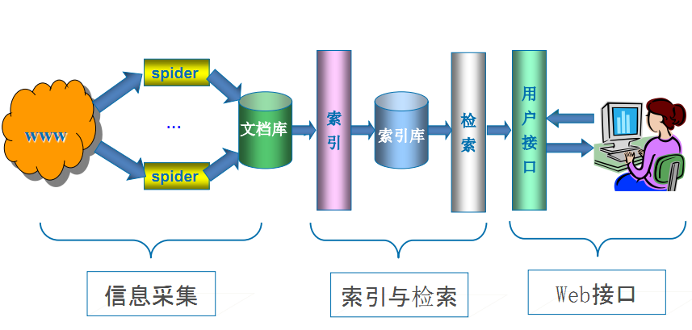

## 通用爬虫和聚焦爬虫

### 根据使用场景，网络爬虫分为_通用爬虫_和_聚焦爬虫_：

#### 通用爬虫

> **通用网络爬虫** 是 捜索引擎抓取系统（Google、Yahoo）的重要组成部分
>
> 主要目的是将互联网上的网页下载到本地，形成一个互联网内容的镜像备份

* 工作原理：

  1. 抓取网页

     > 1. 首先选取一部分种子URL放入待抓取URL队列
     > 2. 取出待抓取URL，解析DNS得到主机IP，并将URL对应的网页下载下来，存储进已下载网页库中，并且将这些URL放进已抓取URL队列
     > 3. 分析已抓取URL队列中的URL，将其中的其他URL放入待抓取URL队列，从而进入下一个循环....

     

  2. 存储数据

     > * 搜索引擎将通过爬虫爬取到的网页存入原始页面数据库。其中的页面数据与用户浏览器得到的HTML是完全一样的
     > * 搜索引擎蜘蛛在抓取页面时，也做一定的重复内容检测，一旦遇到访问权重很低的网站上有大量抄袭、采集或者复制的内容，很可能就不再爬取

  3. 预处理

     > 搜索引擎将爬虫抓取回来的页面，进行各种步骤的预处理：
     >
     > * 提取文字
     > * 中（英）文分词
     > * 消除噪音（例如版权声明文字、导航条、广告...）
     > * 索引生成
     > * 链接关系计算
     > * 特殊文字处理
     > * ...

  除了HTML文件外，搜索引擎通常还能抓取和索引以文字为基础的多种文件类型，如 PDF、Word、WPS、XLS、PPT、TXT 文件等，搜索结果中也经常会看到这些文件类型，但搜索引擎还不能处理图片、视频、Flash 这类非文字内容，也不能执行脚本和程序

  4. 提供检索服务，网站排名

     > 搜索引擎在对信息进行组织和处理后，为用户提供关键字检索服务，将用户检索相关的信息展示给用户
     >
     > 同时会根据页面的**PageRank**值（链接的访问量排名）来进行网站排名，这样**Rank**值高的网站在搜索结果中会排名较前，当然也可以直接使用**Money**购买搜索引擎网站排名，简单粗暴

     

* 局限性

  1. 通用搜索引擎所返回的结果都是网页，而大多情况下，网页里90%的内容对用户来说都是无用的
  2. 不同领域、不同背景的用户往往具有不同的检索目的和需求，搜索引擎无法提供针对具体某个用户的搜索结果
  3. 万维网数据形式的丰富和网络技术的不断发展，图片、数据库、音频、视频多媒体等不同数据大量出现，通用搜索引擎对这些文件无能为力，不能很好地发现和获取
  4. 通用搜索引擎大多提供基于关键字的检索，难以支持根据语义信息提出的查询，无法准确理解用户的具体需求

---

#### 聚焦爬虫

> **聚焦爬虫**，是"面向特定主题需求"的一种网络爬虫程序，它与通用搜索引擎爬虫的区别在于： _聚焦爬虫在实施网页抓取时会对内容进行处理筛选，尽量保证只抓取与需求相关的网页信息_

