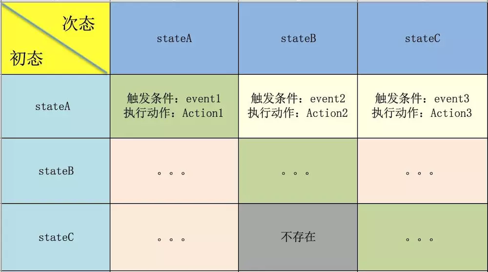

# 状态机

---

当前的状态称为“初态/现态”，它有一个“触发条件”属性，当这个属性被满足时会触发一个“动作”或者单纯状态的迁移，“动作”执行完毕或者“状态”迁移完毕后的新的状态相对于过去是“次态”，相对于未来是“初态/现态”

---

## 状态机4要素

1. 初态：当前所处的状态
2. 条件：即“事件”，当一个条件被满足，就会触发一个特定的动作或者进行一次状态迁移
3. 动作：条件满足时执行的动作，动作执行完毕后可以迁移到新状态或者保持原状态，动作不是必须的，条件满足后也可以不执行任何动作二直接迁移到新的状态
4. 次态：条件满足后要迁移到的新的状态，“次态”是相对于“初态”而言的，“次态”一旦被激活就会成为新的“初态”

**初态**和**条件**是因，**动作**和**次态**是果

